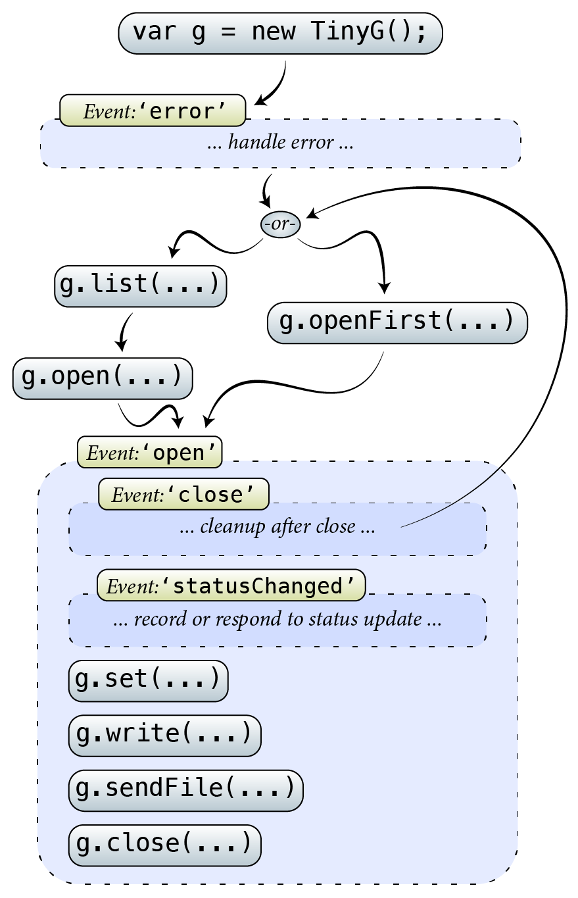

:toc: macro
:toclevels: 6
:icons: font

toc::[]

# TinyG node module API.

This is the programmer's documentation for the official https://github.com/giseburt/TinyG-node[TinyG Node module]: `tinyg`.

## Usage summary

The `tinyg` module is an asynchronous wrapper on top of the https://github.com/voodootikigod/node-serialport[node-serialport] module, and handles all of the protocol involved in sending commands and files to a TinyG, along with handling responses and errors appropriately.

Much of the interaction with the `tinyg` module is handled by https://nodejs.org/api/events.html[EventEmitter] events. This basically means that you write `g.on('eventName', function(value) {...})` in order to handle them, and they can generally happen "at any time". (See the explanation of each event below to see when you can expect each type of event.)

The general flow of using the `tinyg` module is shown in <<fig1>>.

[[fig1]]
.tinyg API general code flow

In code, the looks roughly like:

[[code-flow-code]]
[source,javascript]
.example-1.js
----
// Create a TinyG library object
var TinyG = require("tinyg");
// Then create a TinyG object called 'g'
var g = new TinyG();
// Setup an error handler
g.on('error', function(error) {
  // ...
});
// Open the first connected device found
g.openFirst();
// OR: Open a specific device with one serial ports:
//    g.open(portPath);
// OR: Open a specific G2 Core device with two virtual serial ports:
//    g.open(portPath,
//            {dataPortPath : dataPortPath});

// Make a status handler
var statusHandler = function(st) {
  process.stdout.write(
    util.inspect(status) + "\n"
  );
};

// Make a close handler
var closeHandler = function() {
  // Stop listening to events when closed
  // This is only necessary for programs that don't exit.
  g.removeListener('statusChanged', statusHandler);
  g.removeListener('close', closeHandler);
}

// Setup an open handler, that will then setup all of the other handlers
g.on('open', function() {
  // Handle status reports ({"sr":{...}})
  g.on('statusChanged', statusHandler);
  // handle 'close' events
  g.on('close', closeHandler);

  // We now have an active connection to a tinyg.
  // We can use g.set(...) to set parameters on the tinyg,
  // and g.get() to read parameters (returns a promise, BTW).

  // We can also use g.sendFile() to handle sending a file.
});

----

## API

### Errors

The `'error'` event will pass one parameter: a object of type `TinyGError`, which inherits from node's built-in `Error`.

It uses the `Error` class' `name` and `message` properties. All `TinyGError` objects will have a `name` in the format of `TinyG`+_N_+`Error`. Listed below are the specific error names and what they mean, along with when they might occur.

In addition to the `Error` class parameters, a `TinyGError` class has a `data` parameter with the raw data that caused the error.

.TinyGError Names
TinyGParserError::
  * *Meaning*: Data coming from the TinyG was malformed
  * *When*: During an open connection
  * *Data Contents*:
  ** `err` is the error from the JSON parser
  ** `part` is the raw string that was given to the parser

TinyGResponseError::
  * *Meaning*: TinyG reported an error
  * *When*: During an open connection
  * *Data Contents*: The exact _parsed_ JSON response from the TinyG.

TinyGOpenError::
  * *Meaning*: TinyG failed to open a connection. This may occur if one was already open, in which case there is no change to the already-open connection, but the new one was not attempted.
  * *When*: Any time after <<open,`g.open()`>> has been called.
  * *Data Contents*: _None._

TinyGSerialPortError::
  * *Meaning*: The underlying serialport object had an error.
  * *When*: Anytime after <<open,`g.open()`>> was called.
  * *Data contents*: The raw error object from serialport.

TinyGWriteError::
  * *Meaning*: The underlying serialport object reported a write error.
  * *When*: Anytime there's an open connection.
  * *Data Contents*: The raw error from serialport.

TinyGReadStreamError::
  * *Meaning*: The underlying readStream used by <<sendFile,`g.sendFile()`>> reported an error.
  * *When*: After calling <<sendFile,`g.sendFile()`>>
  * *Data Contents*: The raw error from readStream.

TinyGOpenFirstError::
  * *Meaning*: <<openFirst,`g.openFirst()`>> was unable to open a TinyG.
  * *When*: After calling `g.openFirst()`.
  * *Data Contents*: The `results` value returned by <<list,`g.list()`>>.

TinyGOpenFirstListError::
  * *Meaning*: <<openFirst,`g.openFirst()`>> was unable to list TinyGs.
  * *When*: After calling `g.openFirst()`.
  * *Data Contents*: The `err` value returned by <<list,`g.list()`>>.

### Classes and Methods

#### Class TinyG

##### [[open]]`open(` _path_ `,` _options_ `)`
  * Open the connection.
  ** *Returns:* _nothing_
  ** `path`:
  ** `options`:

##### [[close]]`close()`
  * Close the connection.
  ** *Returns:* _nothing_

##### [[write]]`write(` _value_ `)`
  * Write value to the TinyG.
  ** *Returns:* _nothing_
  ** `value`:

##### [[writeWithPromise]]`writeWithPromise(` _value_ `)`
  * Write value to the TinyG.
  ** *Returns:* Promise.
  ** `value`:

##### [[set]]`set(` _value_ `)`
  * Set the given value on the TinyG.
  ** *Returns:* Promise
  ** `value`:

##### [[get]]`get(` _key_ `)`
  * Retrieve the value of the given key from the TinyG.
  ** *Returns:* Promise
  ** `key`:

##### [[sendFile]]`sendFile(` _filename_or_stdin_ `,` _done_callback_ `)`
  * *Returns:* _nothing_
  ** `filename_or_stdin`: Either a path name (in a string) or a `readStream` object (such as `process.stdin`).
  ** `done_callback` (_optional_): A function for the TinyG object to call when the file has finished sending. This will only be called after all lines have been sent AND `stat` has gone to 3 (movement stopped), 4 (program end via `M2` or `M30`), or 6 (alarm).

##### [[list]]`list(` _callback_ `)`
  * Get a list of TinyGs available.
  ** *Returns:* _nothing_
  ** `callback`:

##### [[openFirst]]`openFirst(` _failIfMore_, _options_ `)`
  * Get a list of TinyGs available.
  ** *Returns:* _nothing_
  ** `failIfMore`:
  ** `options`:
